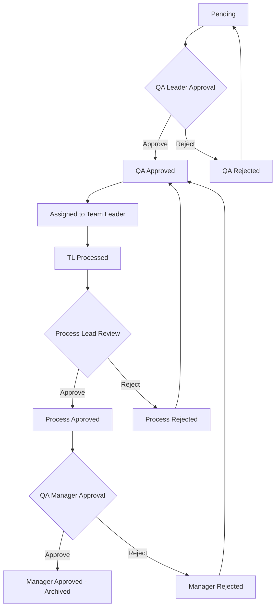

# Quality Assurance Portal Documentation

Last Updated: September 2, 2025

## Table of Contents
1. [System Overview](#system-overview)
2. [Architecture](#architecture)
3. [Technology Stack](#technology-stack)
4. [Installation](#installation)
5. [Project Structure](#project-structure)
6. [Database Schema](#database-schema)
7. [User Roles and Permissions](#user-roles-and-permissions)
8. [Workflow](#workflow)
9. [API Documentation](#api-documentation)
10. [Components](#components)
11. [Development Guidelines](#development-guidelines)
12. [Deployment](#deployment)
13. [Troubleshooting](#troubleshooting)

## System Overview

The Quality Assurance Portal is a comprehensive system designed to manage Non-Conformance Product (NCP) reports throughout their lifecycle. The system provides a structured workflow for identifying, reviewing, processing, and approving quality issues in a manufacturing environment.

### Key Features
- Multi-role user management with role-based access control
- Complete NCP workflow from submission to final approval
- Real-time notifications and status tracking
- Comprehensive reporting and analytics
- Audit trail for all system activities
- Super Admin capabilities for system management

## Architecture

The system follows a modern web application architecture:

```
┌─────────────────┐    ┌─────────────────┐    ┌─────────────────┐
│   Frontend      │    │   Backend API   │    │   Database      │
│   (Next.js)     │◄──►│   (Next.js API  │◄──►│   (SQLite)      │
│                 │    │    Routes)      │    │                 │
└─────────────────┘    └─────────────────┘    └─────────────────┘
         │                       │                       │
         ▼                       ▼                       ▼
┌─────────────────┐    ┌─────────────────┐    ┌─────────────────┐
│   UI Library    │    │   Business      │    │   Data Models   │
│   (shadcn/ui)   │    │   Logic         │    │                 │
└─────────────────┘    └─────────────────┘    └─────────────────┘
```

## Technology Stack

### Frontend
- **Next.js 14** - React framework with App Router
- **TypeScript** - Type-safe JavaScript
- **Tailwind CSS** - Utility-first CSS framework
- **shadcn/ui** - Reusable component library
- **Recharts** - Charting library
- **Lucide React** - Icon library

### Backend
- **Next.js API Routes** - Serverless functions
- **Better SQLite3** - Database library
- **Bcrypt.js** - Password hashing
- **Jose** - JWT token handling

### Database
- **SQLite** - Lightweight relational database

### Development Tools
- **ESLint** - Code linting
- **Prettier** - Code formatting
- **Git** - Version control

## Installation

### Prerequisites
- Node.js 18+ installed
- npm or pnpm package manager

### Steps

1. Clone the repository:
```bash
git clone <repository-url>
cd qabroadfar2
```

2. Install dependencies:
```bash
npm install
# or
pnpm install
```

3. Create environment variables:
```bash
cp .env.example .env.local
```

4. Update `.env.local` with your configuration:
```env
JWT_SECRET=your-super-secret-jwt-key
```

5. Run the development server:
```bash
npm run dev
# or
pnpm dev
```

6. Open [http://localhost:3000](http://localhost:3000) in your browser

### Production Build

```bash
npm run build
npm start
```

## Project Structure

```
qabroadfar2/
├── app/                    # App Router pages and components
│   ├── api/               # API routes
│   ├── dashboard/         # Dashboard components
│   ├── login/             # Login page
│   └── superadmin/        # Super Admin features
├── components/            # Shared UI components
├── lib/                   # Utility functions and business logic
├── public/                # Static assets
├── styles/                # Global styles
├── docs/                  # Documentation
├── .next/                 # Next.js build output
├── node_modules/          # Dependencies
├── .env.local            # Environment variables
├── .gitignore            # Git ignore rules
├── next.config.mjs       # Next.js configuration
├── package.json          # Project dependencies
├── pnpm-lock.yaml        # Dependency lock file
├── postcss.config.mjs    # PostCSS configuration
├── tailwind.config.ts    # Tailwind CSS configuration
└── tsconfig.json         # TypeScript configuration
```

## Database Schema

### Users Table
```sql
CREATE TABLE users (
  id INTEGER PRIMARY KEY AUTOINCREMENT,
  username TEXT UNIQUE NOT NULL,
  password TEXT NOT NULL,
  role TEXT DEFAULT 'user',
  full_name TEXT,
  is_active BOOLEAN DEFAULT TRUE,
  created_at DATETIME DEFAULT CURRENT_TIMESTAMP
);
```

### NCP Reports Table
```sql
CREATE TABLE ncp_reports (
  id INTEGER PRIMARY KEY AUTOINCREMENT,
  ncp_id TEXT UNIQUE NOT NULL,
  sku_code TEXT NOT NULL,
  machine_code TEXT NOT NULL,
  date TEXT NOT NULL,
  time_incident TEXT NOT NULL,
  hold_quantity INTEGER NOT NULL,
  hold_quantity_uom TEXT NOT NULL,
  problem_description TEXT NOT NULL,
  photo_attachment TEXT,
  qa_leader TEXT NOT NULL,
  status TEXT DEFAULT 'pending',
  submitted_by TEXT NOT NULL,
  submitted_at DATETIME DEFAULT CURRENT_TIMESTAMP,

  -- QA Leader Approval Fields
  qa_approved_by TEXT,
  qa_approved_at DATETIME,
  disposisi TEXT,
  jumlah_sortir TEXT DEFAULT '0',
  jumlah_release TEXT DEFAULT '0',
  jumlah_reject TEXT DEFAULT '0',
  assigned_team_leader TEXT,
  qa_rejection_reason TEXT,

  -- Team Leader Fields
  tl_processed_by TEXT,
  tl_processed_at DATETIME,
  root_cause_analysis TEXT,
  corrective_action TEXT,
  preventive_action TEXT,

  -- Process Lead Fields
  process_approved_by TEXT,
  process_approved_at DATETIME,
  process_rejection_reason TEXT,
  process_comment TEXT,

  -- QA Manager Fields
  manager_approved_by TEXT,
  manager_approved_at DATETIME,
  manager_rejection_reason TEXT,
  manager_comment TEXT,

  -- Final status
  archived_at DATETIME
);
```

### Audit Log Table
```sql
CREATE TABLE ncp_audit_log (
  id INTEGER PRIMARY KEY AUTOINCREMENT,
  ncp_id TEXT NOT NULL,
  changed_by TEXT NOT NULL,
  changed_at DATETIME DEFAULT CURRENT_TIMESTAMP,
  field_changed TEXT NOT NULL,
  old_value TEXT,
  new_value TEXT,
  description TEXT
);
```

### System Logs Table
```sql
CREATE TABLE system_logs (
  id INTEGER PRIMARY KEY AUTOINCREMENT,
  level TEXT NOT NULL,
  message TEXT NOT NULL,
  details TEXT,
  created_at DATETIME DEFAULT CURRENT_TIMESTAMP
);
```

### API Keys Table
```sql
CREATE TABLE api_keys (
  id INTEGER PRIMARY KEY AUTOINCREMENT,
  key TEXT UNIQUE NOT NULL,
  service_name TEXT NOT NULL,
  permissions TEXT NOT NULL,
  created_at DATETIME DEFAULT CURRENT_TIMESTAMP,
  last_used_at DATETIME,
  is_active BOOLEAN DEFAULT TRUE
);
```

### System Settings Table
```sql
CREATE TABLE system_settings (
  id INTEGER PRIMARY KEY AUTOINCREMENT,
  setting_key TEXT UNIQUE NOT NULL,
  setting_value TEXT NOT NULL,
  description TEXT
);
```

### SKU Codes Table
```sql
CREATE TABLE sku_codes (
  id INTEGER PRIMARY KEY AUTOINCREMENT,
  code TEXT UNIQUE NOT NULL,
  description TEXT NOT NULL,
  created_at DATETIME DEFAULT CURRENT_TIMESTAMP
);
```

### Machines Table
```sql
CREATE TABLE machines (
  id INTEGER PRIMARY KEY AUTOINCREMENT,
  code TEXT UNIQUE NOT NULL,
  name TEXT NOT NULL,
  created_at DATETIME DEFAULT CURRENT_TIMESTAMP
);
```

### UOMs Table
```sql
CREATE TABLE uoms (
  id INTEGER PRIMARY KEY AUTOINCREMENT,
  code TEXT UNIQUE NOT NULL,
  name TEXT NOT NULL,
  created_at DATETIME DEFAULT CURRENT_TIMESTAMP
);
```

## User Roles and Permissions

### User Roles
1. **User (QA User)** - Basic users who can submit NCP reports
2. **QA Leader** - Reviews and approves initial NCP reports
3. **Team Leader** - Performs root cause analysis and corrective actions
4. **Process Lead** - Reviews team leader's work
5. **QA Manager** - Final approver for NCP reports
6. **Admin** - System administrator with access to most features
7. **Super Admin** - Highest level with full system access

### Role Permissions Matrix

| Feature | User | QA Leader | Team Leader | Process Lead | QA Manager | Admin | Super Admin |
|---------|------|-----------|-------------|--------------|------------|-------|-------------|
| Submit NCP | ✓ | ✓ | ✓ | ✓ | ✓ | ✓ | ✓ |
| View Own NCPs | ✓ | ✓ | ✓ | ✓ | ✓ | ✓ | ✓ |
| View All NCPs |  |  |  |  |  | ✓ | ✓ |
| QA Approval |  | ✓ |  |  |  | ✓ | ✓ |
| RCA Processing |  |  | ✓ |  |  | ✓ | ✓ |
| Process Review |  |  |  | ✓ |  | ✓ | ✓ |
| Final Approval |  |  |  |  | ✓ | ✓ | ✓ |
| User Management |  |  |  |  |  | ✓ | ✓ |
| System Settings |  |  |  |  |  | ✓ | ✓ |
| Audit Logs |  |  |  |  |  | ✓ | ✓ |
| Delete NCPs |  |  |  |  |  |  | ✓ |
| Workflow Intervention |  |  |  |  |  |  | ✓ |

## Workflow

### NCP Report Lifecycle

1. **Submission**
   - User submits NCP report with details
   - Report is assigned to a QA Leader
   - Status: `pending`

2. **QA Leader Review**
   - QA Leader reviews the report
   - Can approve or reject
   - If approved:
     - Assigns to Team Leader
     - Status: `qa_approved`
   - If rejected:
     - Sends back to User with reason
     - Status: `qa_rejected`

3. **Team Leader Processing**
   - Team Leader performs Root Cause Analysis
   - Provides corrective and preventive actions
   - Submits for Process Lead review
   - Status: `tl_processed`

4. **Process Lead Review**
   - Process Lead reviews the RCA and actions
   - Can approve or reject
   - If approved:
     - Forwards to QA Manager
     - Status: `process_approved`
   - If rejected:
     - Sends back to Team Leader
     - Status: `qa_approved` (back to previous step)

5. **QA Manager Final Approval**
   - QA Manager provides final approval
   - Can approve or reject
   - If approved:
     - Report is archived
     - Status: `manager_approved`
   - If rejected:
     - Sends back to Team Leader
     - Status: `qa_approved` (back to previous step)

### Status Transitions



## API Documentation

### Authentication
All API endpoints (except login) require authentication via JWT token in cookies.

#### Login
```
POST /api/auth/login
Content-Type: application/json

{
  "username": "string",
  "password": "string"
}

Response:
{
  "success": true,
  "token": "jwt-token"
}
```

#### Logout
```
POST /api/auth/logout

Response:
{
  "success": true
}
```

#### Get Current User
```
GET /api/auth/me

Response:
{
  "success": true,
  "user": {
    "id": 1,
    "username": "john_doe",
    "role": "qa_leader",
    "fullName": "John Doe"
  }
}
```

### Users

#### Get All Users (Super Admin/Admin only)
```
GET /api/users

Response:
[
  {
    "id": 1,
    "username": "john_doe",
    "role": "qa_leader",
    "full_name": "John Doe",
    "is_active": true,
    "created_at": "2023-01-01T00:00:00.000Z"
  }
]
```

#### Create User (Super Admin only)
```
POST /api/users
Content-Type: application/json

{
  "username": "new_user",
  "password": "secure_password",
  "role": "user",
  "fullName": "New User"
}

Response:
{
  "message": "User created successfully"
}
```

#### Update User Role (Super Admin only)
```
PUT /api/users/{id}/role
Content-Type: application/json

{
  "role": "qa_leader"
}

Response:
{
  "message": "User role updated successfully"
}
```

#### Update User Status (Super Admin only)
```
PUT /api/users/{id}/status
Content-Type: application/json

{
  "is_active": false
}

Response:
{
  "message": "User status updated successfully"
}
```

#### Reset User Password (Super Admin only)
```
PUT /api/users/{id}/password
Content-Type: application/json

{
  "password": "new_password"
}

Response:
{
  "message": "User password updated successfully"
}
```

#### Delete User (Super Admin only)
```
DELETE /api/users/{id}

Response:
{
  "message": "User deleted successfully"
}
```

#### Get Users by Role (Admin/Super Admin only)
```
GET /api/users/by-role?role=qa_leader

Response:
[
  {
    "id": 1,
    "username": "john_doe",
    "full_name": "John Doe"
  }
]
```

### NCP Reports

#### Submit NCP Report
```
POST /api/ncp/submit
Content-Type: application/json

{
  "skuCode": "SKU001",
  "machineCode": "MCH001",
  "date": "2023-01-01",
  "timeIncident": "10:30",
  "holdQuantity": 100,
  "holdQuantityUOM": "PCS",
  "problemDescription": "Product defect found",
  "photoAttachment": "base64-encoded-image",
  "qaLeader": "qa_leader_username"
}

Response:
{
  "success": true,
  "ncpId": "2301-0001"
}
```

#### Get NCP Reports
```
GET /api/ncp/list?type=all|pending|approved

Response:
[
  {
    "id": 1,
    "ncp_id": "2301-0001",
    "sku_code": "SKU001",
    "machine_code": "MCH001",
    "date": "2023-01-01",
    "status": "pending",
    "submitted_by": "john_doe",
    "submitted_at": "2023-01-01T10:30:00.000Z"
  }
]
```

#### Get NCP Details
```
GET /api/ncp/details/{id}

Response:
{
  "success": true,
  "data": {
    "id": 1,
    "ncp_id": "2301-0001",
    "sku_code": "SKU001",
    "machine_code": "MCH001",
    "date": "2023-01-01",
    "time_incident": "10:30",
    "hold_quantity": 100,
    "hold_quantity_uom": "PCS",
    "problem_description": "Product defect found",
    "photo_attachment": "base64-encoded-image",
    "qa_leader": "qa_leader_username",
    "status": "pending",
    "submitted_by": "john_doe",
    "submitted_at": "2023-01-01T10:30:00.000Z"
    // ... all other fields
  }
}
```

#### Update NCP Report (Super Admin only)
```
PUT /api/ncp/details/{id}
Content-Type: application/json

{
  "sku_code": "SKU002",
  "problem_description": "Updated problem description"
}

Response:
{
  "message": "NCP report updated successfully"
}
```

#### Delete NCP Report (Super Admin only)
```
DELETE /api/ncp/details/{id}

Response:
{
  "message": "NCP report deleted successfully"
}
```

#### QA Leader Approval
```
PUT /api/ncp/approve-qa
Content-Type: application/json

{
  "id": 1,
  "disposisi": "Sortir",
  "jumlahSortir": "50",
  "jumlahRelease": "30",
  "jumlahReject": "20",
  "assignedTeamLeader": "team_leader_username"
}

Response:
{
  "success": true
}
```

#### Team Leader Processing
```
PUT /api/ncp/process-tl
Content-Type: application/json

{
  "id": 1,
  "rootCauseAnalysis": "Root cause identified",
  "correctiveAction": "Corrective action taken",
  "preventiveAction": "Preventive action planned"
}

Response:
{
  "success": true
}
```

#### Process Lead Approval
```
PUT /api/ncp/approve-process
Content-Type: application/json

{
  "id": 1,
  "comment": "Approved with comments"
}

Response:
{
  "success": true
}
```

#### QA Manager Approval
```
PUT /api/ncp/approve-manager
Content-Type: application/json

{
  "id": 1,
  "comment": "Final approval granted"
}

Response:
{
  "success": true
}
```

#### Revert NCP Status (Super Admin only)
```
PUT /api/ncp/{id}/revert-status
Content-Type: application/json

{
  "status": "pending"
}

Response:
{
  "message": "NCP status reverted successfully"
}
```

#### Reassign NCP (Super Admin only)
```
PUT /api/ncp/{id}/reassign
Content-Type: application/json

{
  "assignee": "new_assignee_username",
  "role": "team_leader"
}

Response:
{
  "message": "NCP reassigned successfully"
}
```

### System Settings

#### Get SKU Codes
```
GET /api/system-settings/sku-codes

Response:
[
  {
    "id": 1,
    "code": "SKU001",
    "description": "Product A"
  }
]
```

#### Create SKU Code (Super Admin only)
```
POST /api/system-settings/sku-codes
Content-Type: application/json

{
  "code": "SKU002",
  "description": "Product B"
}

Response:
{
  "message": "SKU code created successfully",
  "id": 2
}
```

#### Update SKU Code (Super Admin only)
```
PUT /api/system-settings/sku-codes
Content-Type: application/json

{
  "id": 1,
  "code": "SKU001-A",
  "description": "Product A Updated"
}

Response:
{
  "message": "SKU code updated successfully"
}
```

#### Delete SKU Code (Super Admin only)
```
DELETE /api/system-settings/sku-codes?id=1

Response:
{
  "message": "SKU code deleted successfully"
}
```

#### Get Machines
```
GET /api/system-settings/machines

Response:
[
  {
    "id": 1,
    "code": "MCH001",
    "name": "Filling Machine A"
  }
]
```

#### Create Machine (Super Admin only)
```
POST /api/system-settings/machines
Content-Type: application/json

{
  "code": "MCH002",
  "name": "Capping Machine B"
}

Response:
{
  "message": "Machine created successfully",
  "id": 2
}
```

#### Update Machine (Super Admin only)
```
PUT /api/system-settings/machines
Content-Type: application/json

{
  "id": 1,
  "code": "MCH001-A",
  "name": "Filling Machine A Updated"
}

Response:
{
  "message": "Machine updated successfully"
}
```

#### Delete Machine (Super Admin only)
```
DELETE /api/system-settings/machines?id=1

Response:
{
  "message": "Machine deleted successfully"
}
```

#### Get UOMs
```
GET /api/system-settings/uoms

Response:
[
  {
    "id": 1,
    "code": "PCS",
    "name": "Pieces"
  }
]
```

#### Create UOM (Super Admin only)
```
POST /api/system-settings/uoms
Content-Type: application/json

{
  "code": "KG",
  "name": "Kilograms"
}

Response:
{
  "message": "UOM created successfully",
  "id": 2
}
```

#### Update UOM (Super Admin only)
```
PUT /api/system-settings/uoms
Content-Type: application/json

{
  "id": 1,
  "code": "PCS-U",
  "name": "Pieces Updated"
}

Response:
{
  "message": "UOM updated successfully"
}
```

#### Delete UOM (Super Admin only)
```
DELETE /api/system-settings/uoms?id=1

Response:
{
  "message": "UOM deleted successfully"
}
```

#### Get System Setting
```
GET /api/system-settings/config?key=ncp_format

Response:
{
  "key": "ncp_format",
  "value": "YYMM-XXXX"
}
```

#### Set System Setting (Super Admin only)
```
POST /api/system-settings/config
Content-Type: application/json

{
  "key": "ncp_format",
  "value": "YYYY-MM-XXXX",
  "description": "Updated NCP numbering format"
}

Response:
{
  "message": "System setting updated successfully"
}
```

### Monitoring

#### Get Audit Logs (Super Admin only)
```
GET /api/audit-log

Response:
[
  {
    "id": 1,
    "ncp_id": "2301-0001",
    "changed_by": "super_admin",
    "changed_at": "2023-01-01T10:30:00.000Z",
    "field_changed": "status",
    "old_value": "pending",
    "new_value": "qa_approved",
    "description": "Status updated by super_admin"
  }
]
```

#### Get System Logs (Super Admin only)
```
GET /api/system-logs

Response:
[
  {
    "id": 1,
    "level": "info",
    "message": "User login successful",
    "details": "User super_admin logged in",
    "created_at": "2023-01-01T10:30:00.000Z"
  }
]
```

#### Get API Keys (Super Admin only)
```
GET /api/api-keys

Response:
[
  {
    "id": 1,
    "key": "sk_1234567890abcdef",
    "service_name": "Mobile App",
    "permissions": "[\"read\", \"write\"]",
    "created_at": "2023-01-01T10:30:00.000Z",
    "last_used_at": null,
    "is_active": true
  }
]
```

#### Create API Key (Super Admin only)
```
POST /api/api-keys
Content-Type: application/json

{
  "serviceName": "Analytics Service",
  "permissions": ["read"]
}

Response:
{
  "key": "sk_new_api_key_here"
}
```

#### Delete API Key (Super Admin only)
```
DELETE /api/api-keys/{id}

Response:
{
  "message": "API key deleted successfully"
}
```

#### Get Analytics Data (Super Admin only)
```
GET /api/analytics

Response:
{
  "monthlyData": [...],
  "averageApprovalTime": 2.5,
  "statusDistribution": [...],
  "topSubmitters": [...],
  "ncpStats": {...}
}
```

### Dashboard

#### Get Dashboard Stats
```
GET /api/dashboard/stats

Response:
{
  "data": {
    "stats": {
      "total": 100,
      "pending": 10,
      "approved": 70,
      "processed": 20,
      "qaApproved": 30,
      "tlProcessed": 20,
      "process_approved": 15,
      "manager_approved": 55,
      "rejected": 5
    },
    "charts": {
      "monthly": [...],
      "statusDistribution": [...],
      "topSubmitters": [...]
    }
  }
}
```

#### Get Dashboard NCPs
```
GET /api/dashboard/ncps?type=all|pending

Response:
{
  "data": [...]
}
```

## Components

### UI Components

#### AppSidebar
Navigation sidebar component that shows different menu items based on user role.

Props:
- `userInfo`: User information object
- `currentPage`: Currently active page
- `setCurrentPage`: Function to change current page

#### DashboardHeader
Header component showing user information and logout functionality.

Props:
- `userInfo`: User information object

#### RoleSpecificDashboard
Dashboard component that renders different content based on user role.

Props:
- `userInfo`: User information object

#### DatabaseNCP
Component for viewing and managing all NCP reports.

Props:
- `userInfo`: User information object

#### UserManagement
Component for managing system users (Super Admin feature).

#### SystemSettings
Component for managing system-wide configurations (Super Admin feature).

#### AuditLog
Component for viewing audit trail (Super Admin feature).

#### SystemLogs
Component for viewing system logs (Super Admin feature).

#### ApiKeysManagement
Component for managing API keys (Super Admin feature).

#### BackupRestore
Component for database backup and restore (Super Admin feature).

#### AnalyticsDashboard
Component for viewing system analytics (Super Admin feature).

### Utility Functions

#### Authentication (`lib/auth.ts`)
- `verifyAuth`: Verifies JWT token and returns user information

#### Database (`lib/database.ts`)
- `initializeDatabase`: Initializes database tables
- `authenticateUser`: Authenticates user with username and password
- `getAllUsers`: Gets all users from database
- `createUser`: Creates a new user
- `updateUserRole`: Updates user role
- `updateUserStatus`: Updates user status
- `updateUserPassword`: Updates user password
- `deleteUser`: Deletes a user
- `createNCPReport`: Creates a new NCP report
- `getAllNCPReports`: Gets all NCP reports
- `getNCPById`: Gets NCP report by ID
- `approveNCPByQALeader`: Approves NCP by QA Leader
- `processNCPByTeamLeader`: Processes NCP by Team Leader
- `approveNCPByProcessLead`: Approves NCP by Process Lead
- `approveNCPByQAManager`: Approves NCP by QA Manager
- `superEditNCP`: Edits NCP by Super Admin
- `revertNCPStatus`: Reverts NCP status by Super Admin
- `reassignNCP`: Reassigns NCP by Super Admin
- `getAuditLog`: Gets audit log entries
- `logSystemEvent`: Logs system events
- `getSystemLogs`: Gets system logs
- `getApiKeys`: Gets API keys
- `createApiKey`: Creates API key
- `deleteApiKey`: Deletes API key
- `getSystemSetting`: Gets system setting
- `setSystemSetting`: Sets system setting
- And many more utility functions...

## Development Guidelines

### Code Style
- Follow TypeScript best practices
- Use functional components with React hooks
- Maintain consistent naming conventions
- Write descriptive comments for complex logic
- Use ESLint and Prettier for code formatting

### Component Structure
```tsx
// Example component structure
import React from "react"
import { Button } from "@/components/ui/button"

interface ComponentProps {
  // Define props interface
}

export function ComponentName({ prop1, prop2 }: ComponentProps) {
  // Component logic here
  
  return (
    <div>
      {/* Component JSX */}
    </div>
  )
}
```

### API Route Structure
```ts
// Example API route structure
import { NextRequest, NextResponse } from "next/server"
import { verifyAuth } from "@/lib/auth"

export async function GET(request: NextRequest) {
  try {
    // Authentication check
    const auth = await verifyAuth(request)
    if (!auth) {
      return NextResponse.json({ error: "Unauthorized" }, { status: 401 })
    }
    
    // Authorization check
    if (auth.role !== "required_role") {
      return NextResponse.json({ error: "Forbidden" }, { status: 403 })
    }
    
    // Business logic
    const data = getData()
    
    // Return success response
    return NextResponse.json(data)
  } catch (error) {
    console.error("Error:", error)
    return NextResponse.json({ error: "Internal Server Error" }, { status: 500 })
  }
}
```

### Database Functions
```ts
// Example database function
export function getUserById(id: number) {
  return db.prepare("SELECT * FROM users WHERE id = ?").get(id)
}
```

### Error Handling
- Always handle errors in API routes
- Return appropriate HTTP status codes
- Log errors for debugging
- Provide user-friendly error messages

### Timezone Handling
All timestamps in the application are displayed in Western Indonesia Time (WIB / GMT+7) to ensure consistency across all users. The application uses the `date-fns-tz` library to properly format dates and times in WIB.

Key date utility functions:
- `formatToWIB`: Formats dates with time in WIB (dd MMM yyyy, HH:mm:ss)
- `formatDateOnlyWIB`: Formats date only in WIB (dd MMM yyyy)
- `formatTimeOnlyWIB`: Formats time only in WIB (HH:mm:ss)

### Testing
- Write unit tests for utility functions
- Test API routes with different scenarios
- Test UI components with different props
- Perform end-to-end testing for critical workflows

## Deployment

### Environment Variables
Create a `.env.production` file with production values:
```env
JWT_SECRET=your-production-jwt-secret
```

### Build Process
```bash
npm run build
```

### Start Production Server
```bash
npm start
```

### Docker Deployment (Optional)
Create a `Dockerfile`:
```dockerfile
FROM node:18-alpine

WORKDIR /app

COPY package*.json ./
RUN npm install

COPY . .

RUN npm run build

EXPOSE 3000

CMD ["npm", "start"]
```

Build and run:
```bash
docker build -t qa-portal .
docker run -p 3000:3000 qa-portal
```

### CI/CD Pipeline
Example GitHub Actions workflow (`.github/workflows/deploy.yml`):
```yaml
name: Deploy
on:
  push:
    branches: [main]

jobs:
  build:
    runs-on: ubuntu-latest
    steps:
      - uses: actions/checkout@v3
      - uses: actions/setup-node@v3
        with:
          node-version: 18
      - run: npm install
      - run: npm run build
      - run: npm test
```

## Troubleshooting

### Common Issues

#### 1. Database Connection Issues
- Ensure SQLite database file has proper permissions
- Check if database file exists in project root
- Verify database schema is initialized

#### 2. Authentication Problems
- Check JWT_SECRET environment variable
- Verify token expiration settings
- Ensure cookies are enabled in browser

#### 3. API Route Errors
- Check request method matches route handler
- Verify request body format
- Ensure proper authentication headers

#### 4. Build Failures
- Check for TypeScript errors
- Verify all dependencies are installed
- Ensure environment variables are set

### Debugging Tips

1. **Enable Debug Logging**
   ```bash
   DEBUG=next:* npm run dev
   ```

2. **Check Browser Console**
   - Open developer tools
   - Check for JavaScript errors
   - Monitor network requests

3. **Check Server Logs**
   - Look for error messages in terminal
   - Check system logs for database issues

4. **Database Inspection**
   ```bash
   sqlite3 qa_portal.db
   .tables
   .schema table_name
   SELECT * FROM table_name LIMIT 10;
   ```

### Performance Optimization

1. **Database Indexes**
   ```sql
   CREATE INDEX idx_ncp_status ON ncp_reports(status);
   CREATE INDEX idx_ncp_submitted_by ON ncp_reports(submitted_by);
   CREATE INDEX idx_users_role ON users(role);
   ```

2. **API Caching**
   - Implement caching for frequently accessed data
   - Use Redis or similar caching solution for production

3. **Image Optimization**
   - Compress images before upload
   - Use Next.js Image component for optimization

4. **Code Splitting**
   - Use dynamic imports for large components
   - Implement lazy loading for non-critical features

This documentation provides a comprehensive guide to understanding, developing, and maintaining the Quality Assurance Portal. For any questions or issues, please refer to the development team or create an issue in the project repository.